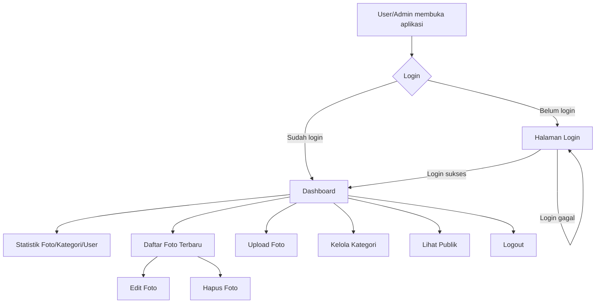

```mermaid
flowchart TD
    A[User/Admin membuka aplikasi] --> B{Login}
    B -- Belum login --> C[Halaman Login]
    B -- Sudah login --> D[Dashboard]
    D --> E[Statistik Foto/Kategori/User]
    D --> F[Daftar Foto Terbaru]
    D --> G[Upload Foto]
    D --> H[Kelola Kategori]
    F --> I[Edit Foto]
    F --> J[Hapus Foto]
    D --> K[Lihat Publik]
    D --> L[Logout]
    C -->|Login sukses| D
    C -->|Login gagal| C

```

